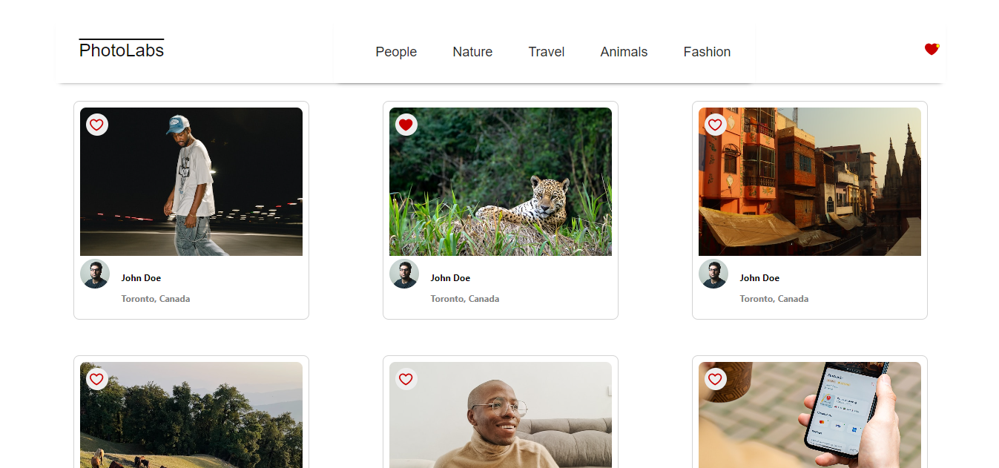
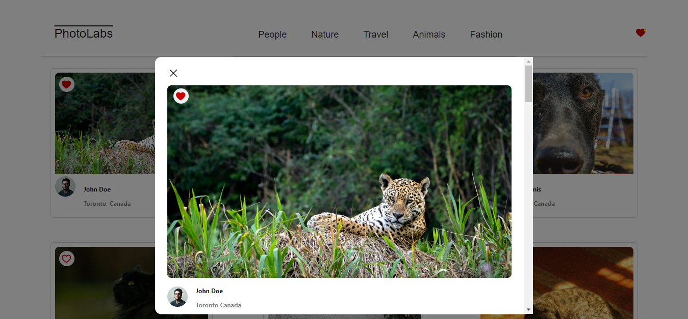
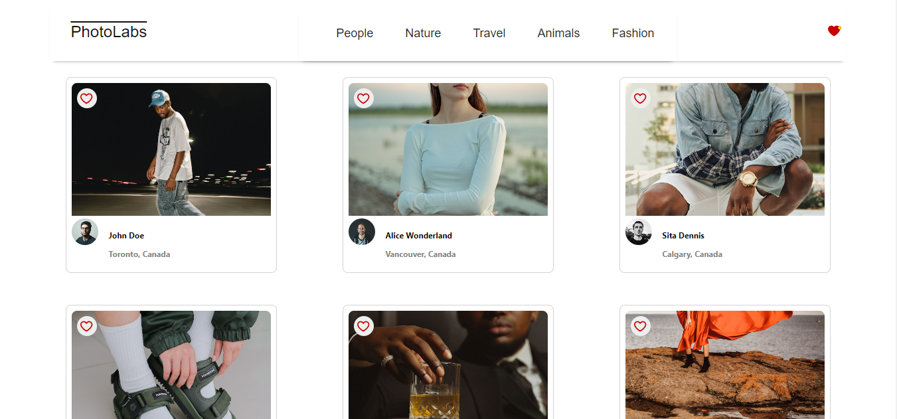

# react-photolabs

The PhotoLabs project for the Web Development React course programming.

# Photolabs

PhotoLabs is an app that allows the user to look at pictures from other users and favorite their, well, favorite ones!



Once a photo is clicked on a card will appear with a larger version of the photo and a list of other similar photos underneath it. The user can favorite the photo from this card too.



The user can also look at pictures that have been grouped in categories by clicking on the categories in the top navigation bar. If they want to go back to having all of the pictures displayed they can click on the Photolabs logo.



## Setup

Install dependencies with `npm install` in each respective `/frontend` and `/backend`.

## [Frontend] Running Webpack Development Server

```sh
cd frontend
npm start
```

## [Backend] Running Backend Servier

Read `backend/readme` for further setup details.

```sh
cd backend
npm start
```
